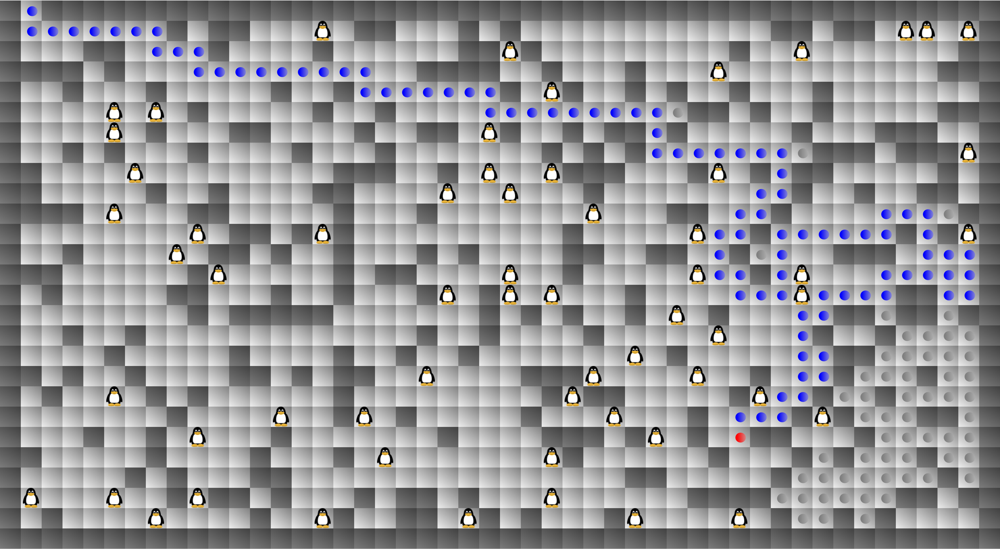

# Maze Walker

Recursive algorithm for finding penguins in a maze including a simple GUI. Start by running `main` and define (1) the width and length of the labyrinth and (2) the desired maximum distance from the starting point. After program execution, the number of rescued penguins is displayed.

_Parameters: width = 48 | length = 27 | max. distance = 100_
